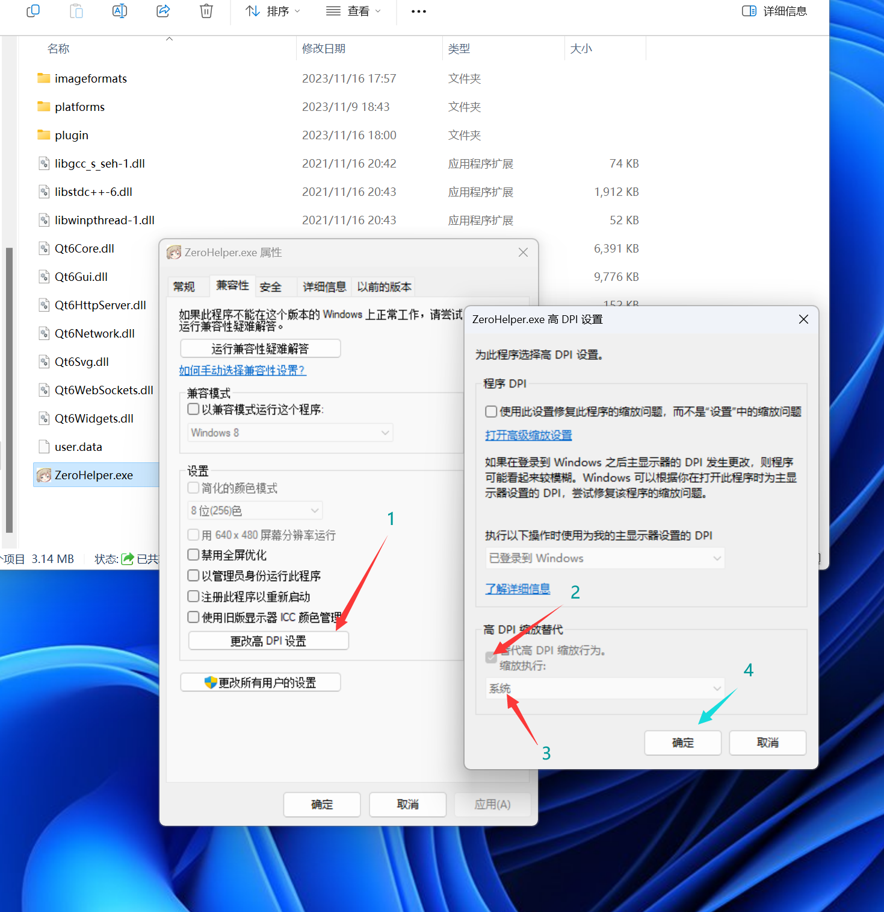

# ZeroHelper

a local launcher of DDTank without install FlashPlayer

一个无需安装flash player就可以游玩弹弹堂的本地启动器

当游戏因为你的文本缩放而出现黑边时请尝试以下办法↓



## Auto Api 脚本接口

when the program is running, use http://127.0.0.1/7233/nickName/{your_account_nickName}/start
to start the game or take games window hwnd

使用 http://127.0.0.1/7233/nickName/{你账号的备注名}/start 来告诉登陆器启动游戏
并获取窗口句柄

# Start 食用方法

## download 下载

 to release (in future)

去release 页面下载（正在搞鼓）

## build 构建

need mingw, vcpkg and qt6 with mingw version

need qhttpserver lib in vcpkg, use this command to install this lib.

需要本机环境有mingw, vcpkg和 qt6.53


需要再vcpkg里面安装qhttpserver库，使用下面的指令即可安装
```commandline

vcpkg install qhttpserver

```

# Todo 待做

## add more services 需要添加更多的游戏服务器

it just only supports one server now, the 4399game server without captcha

现在仅支持4399大区的账号密码登录部分，且验证码待做

## auto take player avatar 自动获取角色头像

just screenshot and cut the avatar out

自动打开好友界面并截图取头像

## add CryptoJS to encrypt password for login 为登录添加加密函数

 now need the encrypt 7Road and 4399

4399和7道的登录方式需要附加加密函数防止第三方偷窥密码

## add webengine as backup way with login 添加浏览器登录模式

just use auto js take game url and load game

使用js完成登录和或许游戏凭证

# more...  更多

 coming sooooooon

咕咕咕
